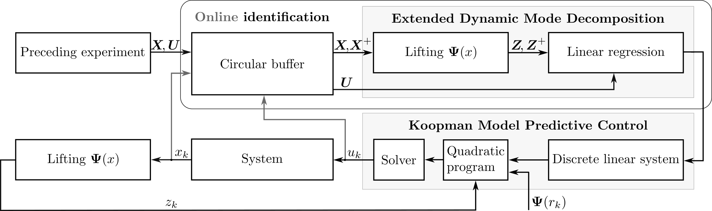

# adaptive-kmpc-py
This is a Python implementation of the **adaptive Koopman model predictive control** algorithm (KMPC), proposed in [https://arxiv.org/abs/2503.17902](https://arxiv.org/abs/2503.17902) (currently under review).  

An equivalent Julia implementation can be found in the [official paper repository](https://github.com/adrianodelr/adaptive-koopman-mpc).

### Adaptive KMPC algorithm
The algorithm is explained in-depth in the linked paper, and veryfied with real-system control examples on a 1R and 2R robot system. To ensure understanding of the code, variable names are chosen according to the notation used in the paper.  

